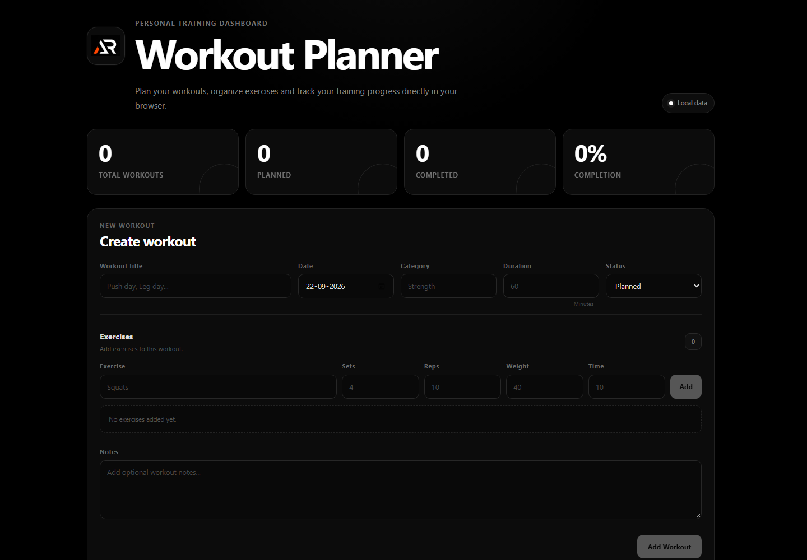

# Workout Planner

A clean and lightweight workout planning application built with React, Vite and styled-components.

Workout Planner helps you create workouts, organize exercises, track workout status and manage your training plan directly in the browser.



## Features

- Create and edit workouts
- Add multiple exercises to each workout
- Track sets, reps, weight and exercise time
- Mark workouts as Planned or Done
- Duplicate workouts
- Delete workouts with confirmation
- Search workouts
- Filter by status and category
- Sort workouts
- Workout statistics
- Responsive dark interface
- Local browser storage
- No backend or account required

## Tech Stack

- React
- Vite
- JavaScript
- styled-components
- LocalStorage

## Project Structure

```text
src
├── components
│   ├── about
│   ├── ConfirmModal
│   ├── EmptyState
│   ├── Footer
│   ├── Header
│   ├── scrollToTopButton
│   ├── Stats
│   ├── WorkoutCard
│   ├── WorkoutForm
│   ├── WorkoutList
│   └── workoutPlanner
├── constants
│   └── workoutConstants.js
├── hooks
│   └── useLocalStorage.js
├── utils
│   └── workoutUtils.js
├── App.jsx
├── index.css
└── main.jsx
```

## Getting Started

Clone the repository:

```bash
git clone https://github.com/a2rp/workout-planner.git
```

Open the project:

```bash
cd workout-planner
```

Install dependencies:

```bash
npm install
```

Start the development server:

```bash
npm run dev
```

Build the application:

```bash
npm run build
```

Preview the production build:

```bash
npm run preview
```

## Data Storage

Workout data is stored locally in the browser using LocalStorage.

No workout data is sent to a server.

Clearing browser storage may remove saved workout data.

## Deployment

The project is configured for GitHub Pages using:

```text
/workout-planner/
```

Build and deployment can be run with:

```bash
npm run deploy
```

## Developer

Developed by [Ashish Ranjan](https://www.ashishranjan.net).

## Links

- [Portfolio](https://www.ashishranjan.net)
- [GitHub](https://github.com/a2rp)
- [CodePen](https://codepen.io/ash1198)
- [LinkedIn](https://www.linkedin.com/in/aashishranjan)
- [Facebook](https://www.facebook.com/theash.ashish)
- [YouTube](https://www.youtube.com/channel/UCLHIBQeFQIxmRveVAjLvlbQ)
- [Email](mailto:ash.ranjan09@gmail.com)

## Support

- [Support](https://a2rp-donation-page.netlify.app/)
- [Buy Me a Coffee](https://buymeacoffee.com/a2rp)
- [Patreon](https://www.patreon.com/a2rp)

## License

This project is licensed under the MIT License.
