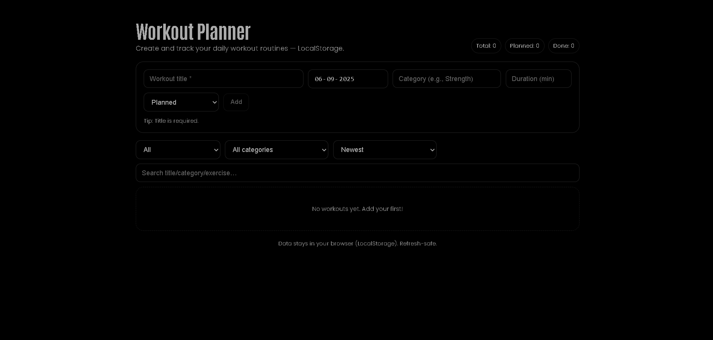

# Workout Planner (React + styled-components)



Create and track your daily workout routines. No backend, no images - dark-theme friendly and fully **LocalStorage** powered.

## Features

-   Add workouts: **title**, **date**, **category**, **duration (min)**, **status** (Planned/Done)
-   Inline edit with **exercises** (name, sets, reps, weight, time)
-   Quick actions: **mark Done/Planned**, **duplicate**, **delete**
-   **Single-row filter bar** (wraps on small screens): filter by **Status** and **Category**, **Sort**, **Search**
-   Responsive flex layout, confirm modal for destructive actions
-   Data persists in **LocalStorage** (refresh-safe)

## Local Install

```bash
git clone https://github.com/a2rp/workout-planner.git
cd workout-planner
npm i
npm run dev
```
